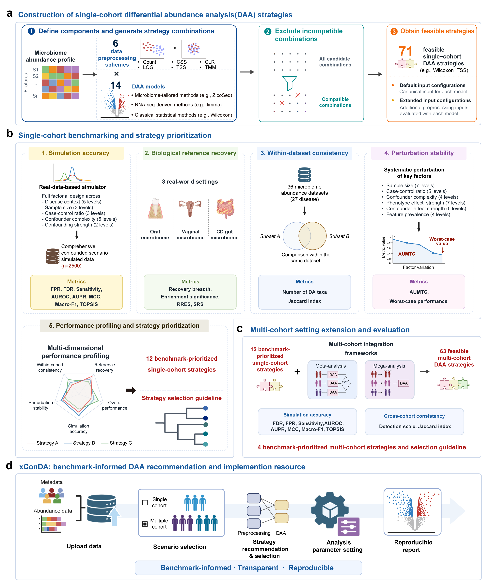

# Benchmarking Confounder-aware Differential Abundance (xConDA) Methods in Microbiome Data

## Workflow

xConDA benchmarks confounder-aware microbiome DAA strategies and translates benchmark evidence into objective-guided strategy selection, execution, and reproducible reporting.



## Introduction

Differential abundance analysis (DAA) is central to microbiome research, but its reliability can be strongly affected by confounding, preprocessing choices, statistical modeling assumptions, and study design. Despite the widespread use of covariate-adjusted DAA methods, practical guidance remains limited for selecting appropriate confounder-aware strategies across different microbiome analysis scenarios.

Here, we present **xConDA**, a strategy-level benchmark and executable resource for confounder-aware microbiome DAA in both single- and multi-cohort settings. We evaluated **72 single-cohort DAA strategies**, each defined by pairing an input preprocessing scheme with a DAA statistical model, across simulation-based accuracy, reference-based biological signal recovery, within-dataset consistency, and perturbation stability. We further evaluated **63 multi-cohort strategies** by integrating benchmark-prioritized single-cohort strategies with meta-analysis and mega-analysis frameworks.

The benchmark shows that no single strategy is uniformly optimal across all evaluation dimensions. Instead, strategy choice should be guided by the analytical objective, including high-confidence inference, balanced default analysis, discovery-oriented signal recovery, and reproducibility-focused analysis. The prioritized strategies are implemented in xConDA (https://www.biosino.org/xconda/) to support scenario-aware strategy selection, execution, and reporting for confounder-adjusted microbiome DAA workflows.

## Key features

- Strategy-level benchmark of 72 single-cohort and 63 multi-cohort microbiome DAA strategies.
- Evaluation across simulation accuracy, biological signal recovery, within-dataset consistency, and perturbation stability.
- Objective-guided recommendations for high-confidence, balanced, discovery-oriented, and reproducibility-focused analyses.
- Executable xConDA workflows for scenario-aware selection and implementation of confounder-adjusted DAA strategies.
- Reproducible code and benchmark resources for transparent microbiome DAA evaluation.

## Repository structure

```text
xConDA_benchmark/
├── R/                                    # R scripts for DAA strategy execution and supporting analysis functions
│   ├── DAA_Strategies/                   # Single-cohort DAA methods and preprocessing strategies
│   ├── Meta_framework/                   # Multi-cohort meta-analysis and mega-analysis framework functions
│   ├── Simulation_generating/            # Simulation data generation utilities
│   └── statistics/                       # Shared statistical filtering and helper functions
├── src/                                  # Source scripts for benchmark evaluation and summary metrics
│   ├── Consistency_evaluation/           # Within-dataset and multi-cohort consistency evaluations
│   ├── Reference-based_evaluation/       # Reference-based biological signal recovery analyses
│   ├── Simulation-based_accuracy_evaluation/ # Simulation accuracy ranking and evaluation scripts
│   └── Stability_performance_evaluation/ # Perturbation stability evaluation scripts
├── Visualization/                         # Panel-level code for main Figures 2-6
├── imgs/                                  # README and workflow images
│   └── Study_design.png                   # xConDA benchmark workflow
├── README.md
└── LICENSE
```

Plotting code for the main manuscript figures is organized by figure and panel in [`Visualization`](Visualization/README.md).

## Software environment

The benchmark analyses were run with the following software versions.

| Software | Version |
| -------- | ------- |
| R        | 4.3.1   |
| Python   | 3.8.18  |

<details>
<summary>R package versions</summary>

| Package | Version |
| ------- | ------- |
| ALDEx2 | 1.34.0 |
| ANCOMBC | 2.4.0 |
| coin | 1.4-3 |
| compositions | 2.0-8 |
| corncob | 0.4.1 |
| DESeq2 | 1.42.1 |
| dplyr | 1.1.4 |
| edgeR | 4.0.16 |
| fastANCOM | 0.0.4 |
| ggplot2 | 3.5.2 |
| GUniFrac | 1.8 |
| limma | 3.58.1 |
| lmerTest | 3.1-3 |
| logging | 0.10.108 |
| Maaslin2 | 1.16.0 |
| metafor | 4.8.0 |
| metagenomeSeq | 1.43.0 |
| metap | 1.11 |
| MuMIn | 1.48.4 |
| paletteer | 1.6.0 |
| patchwork | 1.3.0 |
| pheatmap | 1.0.12 |
| pracma | 2.4.4 |
| purrr | 1.0.2 |
| SparseDOSSA2 | 0.99.2 |
| stringr | 1.5.1 |
| tibble | 3.2.1 |
| tidyverse | 2.0.0 |
| TreeSummarizedExperiment | 2.10.0 |
| VTwins | 0.1.0 |

</details>

## Docker environment

The runtime environment for the code in this repository is available in the prebuilt Docker image [`zhuxinyue/xconda_benchmark:latest`](https://hub.docker.com/r/zhuxinyue/xconda_benchmark).

Pull the image and start an interactive container:

```bash
docker pull zhuxinyue/xconda_benchmark:latest
docker run --rm -it zhuxinyue/xconda_benchmark:latest
```

Run an R script from the current repository directory:

```bash
docker run --rm \
  -v "$PWD:/workspace" \
  zhuxinyue/xconda_benchmark:latest \
  Rscript /workspace/your-script.R
```

## Data availability

All real datasets used in this study were obtained from publicly available resources, including the Bio-Med Big Data Center project [OEP004514](https://www.biosino.org/node/project/detail/OEP004514) and the Bioconductor packages [curatedMetagenomicData](https://bioconductor.org/packages/curatedMetagenomicData/), [HMP16SData](https://bioconductor.org/packages/HMP16SData/), and [MicrobiomeBenchmarkData](https://bioconductor.org/packages/MicrobiomeBenchmarkData/).

Simulated datasets and the complete strategy-level differential abundance analysis outputs generated from all simulated and real datasets are deposited in [Zenodo](https://doi.org/10.5281/zenodo.19883889). Processed performance metrics used for method evaluation are provided in the manuscript's Supplementary Tables.

## Citation

## License

This project is released under the MIT License.
